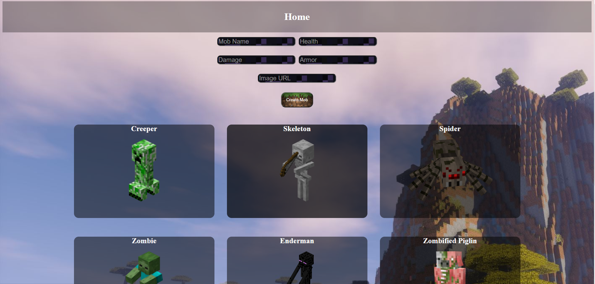
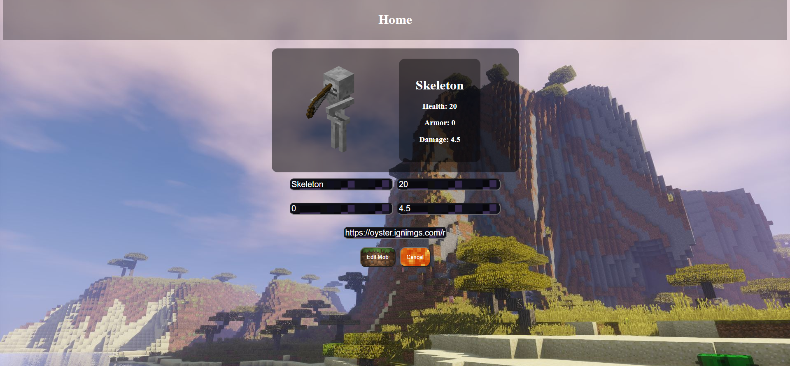

<h1>A Minecraft Story</h1>
<h4>Web application where you can store information of any Minecraft Mob<h4>

<h2>Languages and Stragtegies used</h2>
<ul>
<li>HTML</li>
<li>CSS</li>
<li>JavaScript</li>
<li>CRUD/REST</li>
<li>ExpressJS</li>
<li>ReactJS</li>
<li>Schema/Model Technology</li>
<li>Heroku</li>
<li>Netlify</li> 
<li>MongoDB</li>
<li>Mongoose</li>
</ul>

<h2>Getting Started</h2>

[My Trello Board!](https://trello.com/b/2M1HIiR0/project-3-plans)
  
[Click Here](https://competent-jang-98b344.netlify.app/)  to see the application in action! 

<h2>Unsolved Problems</h2>
<li> I wasn't able to figure out how to seed the information</li>  
  
<h2>Future Enhancements</h2>

<ul>
<li> I want to have a favorites list in the future</li>
<li> I want only logged in users to be able to create and have a favorites list (auth) </li>
<li> I want to add more pages and different sections for different types of entities, maybe including items</li>
</ul>
  
<h2>Take a look!</h2>

  

